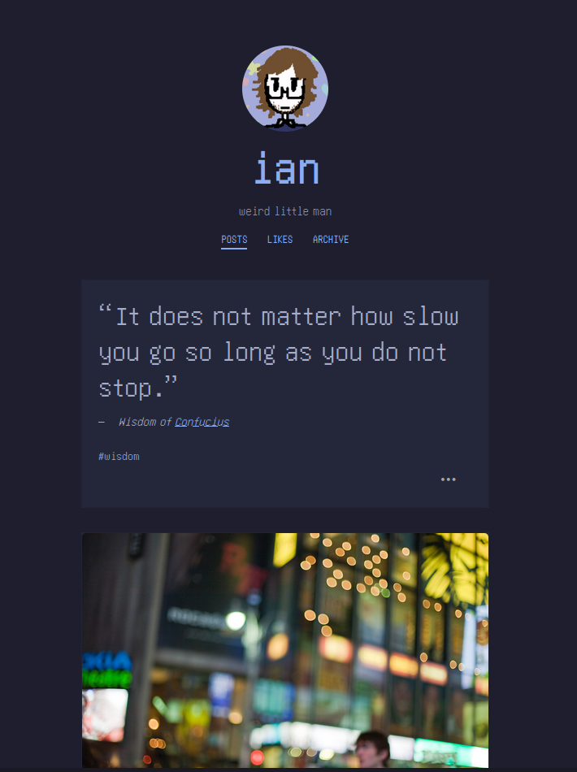

# my tumblr theme

custom CSS &amp; javascript stuff for my tumblr blog

the code is SUPER messy because i doubt anyone else will use this code as-is. it would be better used as a reference, a starting point demonstrating what classes you may/may not want to add to your own tumblr CSS. however, it is FOSS, so use and change it as you see fit, i won't be mad!
